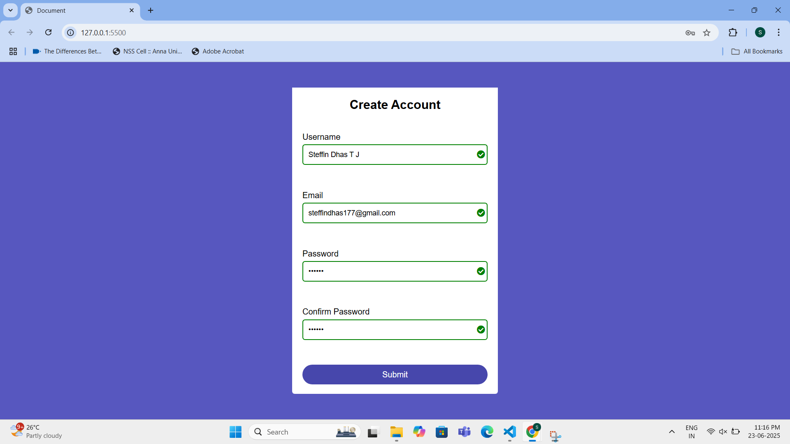
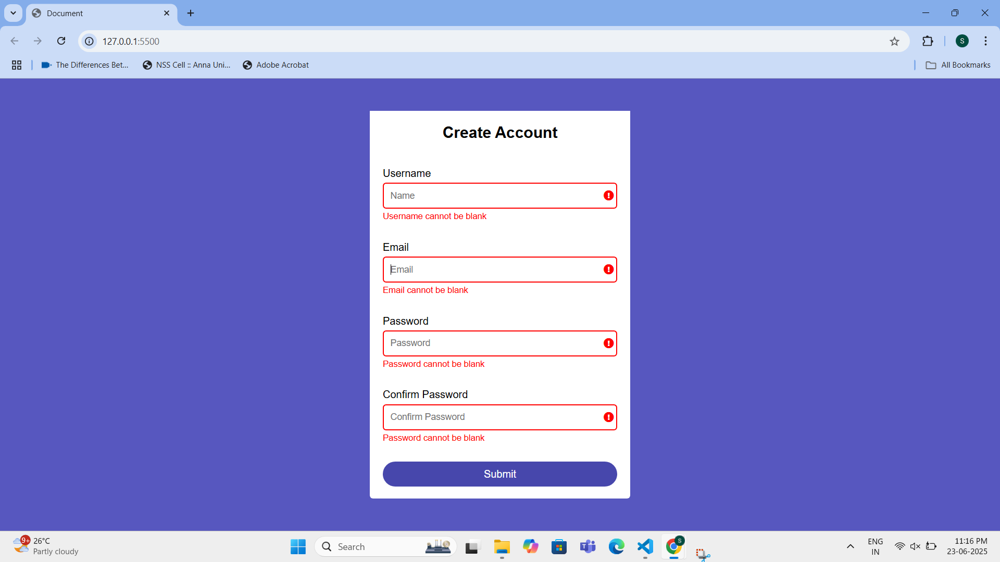

# Responsive Registration Form with Client-Side Validation

This project is a modern and responsive user registration form built using **HTML**, **CSS**, and **Vanilla JavaScript**. It performs **real-time client-side validation** to ensure accurate and complete user input before submission.

## 🚀 Features

- ✅ Real-time input validation for username, email, password, and confirm password
- ❌ Dynamic error messages for invalid or blank fields
- ✔️ Success indication using green borders and icons
- 🔁 Password and confirm-password match validation
- 💡 Responsive UI with Flexbox
- 🎨 Clean and user-friendly design
- 🧩 Font Awesome icons integrated for visual feedback

## 📸 Screenshots

### ✅ Valid Form

### ❌ Invalid Form

> 📁 Place your screenshots inside a `screenshots/` folder in your project.

## 🛠️ Technologies Used

- HTML5
- CSS3
- JavaScript (Vanilla)
- Font Awesome (via CDN)

## 🧾 Project Structure

